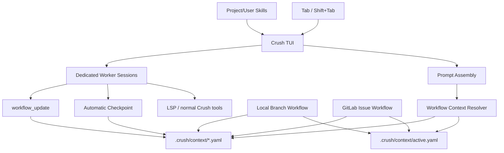
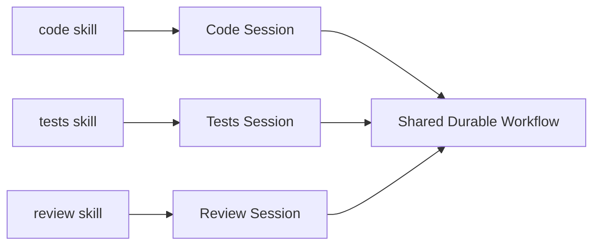
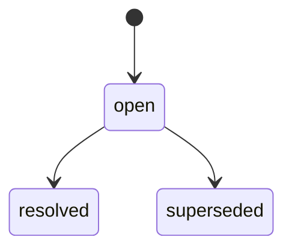
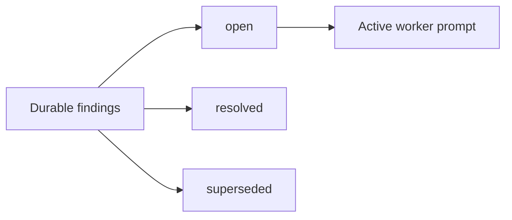
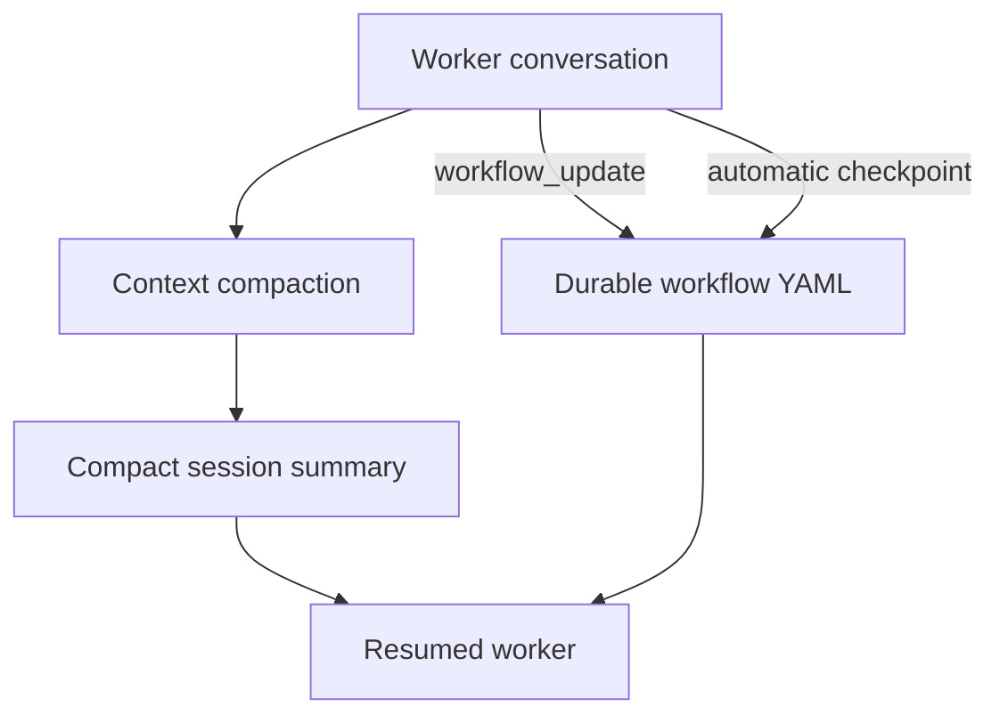
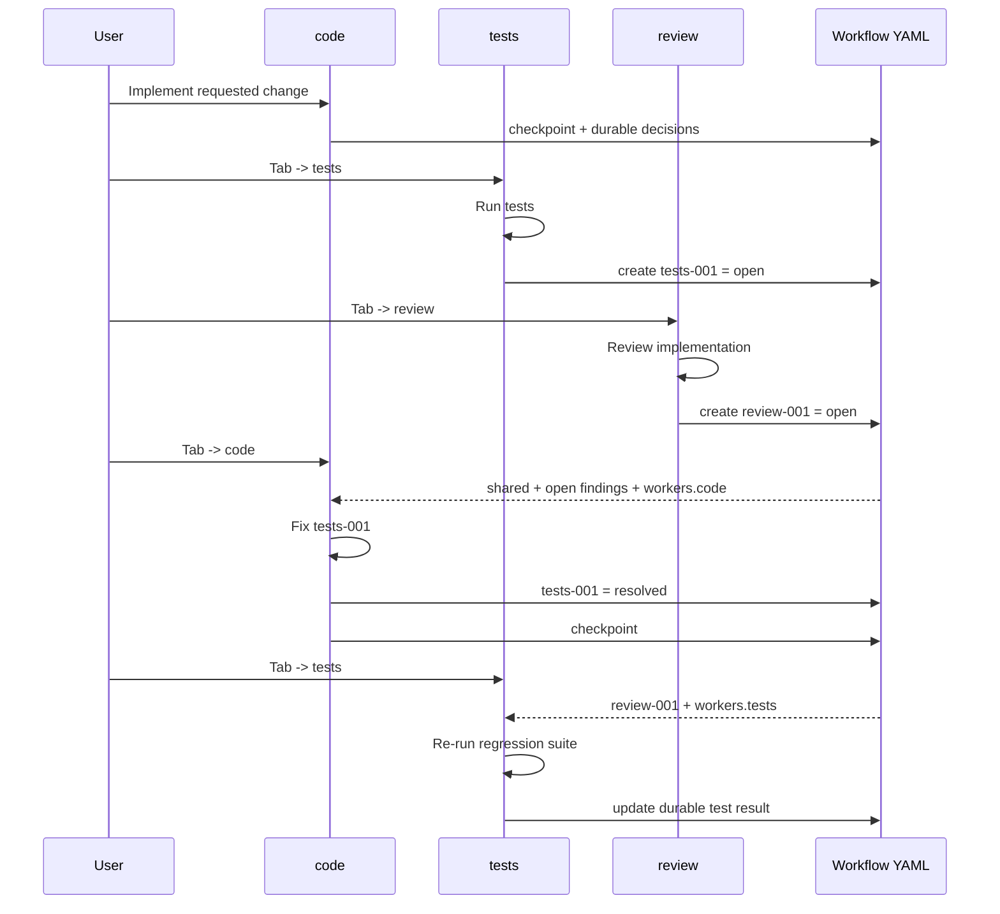

# Crush Workflow Architecture

This document describes the workflow extensions added to Crush to support long-running, multi-role development work with durable project memory.

The goal is to let specialized workers such as `code`, `tests`, and `review` keep independent conversational sessions while sharing a compact, persistent workflow state that survives session switches and context compaction.

> Status: the current implementation passes `go test ./...`.

---

## 1. Goals

The workflow layer is designed around a few principles:

- **Skills define roles** instead of hard-coding role names in Go.
- **Each workflow skill gets its own Crush session** so coding, testing, and review do not pollute each other's conversational context.
- **Durable state lives in YAML**, not only in the model conversation.
- **Only relevant workflow context is injected** into the active worker.
- **Open findings are shared across workers**, while resolved history remains durable without consuming active prompt space.
- **Context compaction is disposable**; the workflow YAML is the authoritative long-lived state.
- **The workflow remains usable without GitLab** through branch-scoped local workflows.
- **GitLab issues can become workflow contexts** without losing previously accumulated worker memory.

---

## 2. High-level architecture



The workflow layer does not replace normal Crush tools or sessions. It adds coordination and durable state around them.

---

## 3. Main components

| Component | Responsibility | Main implementation |
|---|---|---|
| Skill catalog | Discovers workflow-capable skills and reads `workflow-order` | `internal/skills/catalog.go` |
| Skill switching | Cycles workflow skills with `Tab` / `Shift+Tab` | `internal/ui/model/skills.go`, `internal/ui/model/keys.go` |
| Worker sessions | Maintains one Crush session per workflow skill | `internal/workflow/context.go`, `internal/ui/model/skills.go` |
| Workflow activation | Activates local or GitLab-backed context | `internal/workflow/local.go`, `internal/workflow/gitlab.go` |
| Context projection | Injects only shared state, open findings, and selected worker state | `internal/workflow/context.go` |
| Durable updates | Lets the model persist concise workflow memory | `internal/agent/tools/workflow_update.go` |
| Automatic checkpoints | Saves the current request/summary after normal completion and compaction | `internal/agent/agent.go` |
| Findings lifecycle | Tracks cross-worker actionable findings | `internal/workflow/context.go` |
| Compaction summary | Produces concise handoff-oriented summaries | `internal/agent/templates/summary.md` |
| Repetition detection | Detects repeated identical tool interactions in the core agent | `internal/agent/loop_detection.go` |

---

## 4. Workflow directory

Workflow state is stored inside the project:

```text
.crush/
└── context/
    ├── active.yaml
    ├── work-feature-branch.yaml
    └── issue-32.yaml
```

The directory is automatically added to Git's local exclude file:

```text
.git/info/exclude
```

with:

```text
# Crush local workflow memory
.crush/context/
```

This keeps developer-local workflow memory out of commits by default.

---

## 5. Active workflow pointer

`active.yaml` is a small pointer file. It does not contain the actual task memory.

Example:

```yaml
version: 1
active_context: issue-32.yaml
active_skill: code

worker_sessions:
  code: session-code-id
  tests: session-tests-id
  review: session-review-id
```

### Responsibilities

`active.yaml` tracks:

- the currently active workflow context;
- the currently selected workflow skill;
- the dedicated Crush session assigned to each worker.

When the active workflow changes to a different work item, the old worker-session mapping is discarded so unrelated tasks cannot accidentally share worker conversations.

---

## 6. Skills become workflow workers

A normal user or project skill becomes part of the workflow cycle when:

1. it is user-invocable;
2. it is not a system skill;
3. its metadata contains a valid `workflow-order`.

Example:

```yaml
---
name: code
description: Implements production code changes.
user-invocable: true

metadata:
  workflow-order: "10"

context:
  shared: true
  own-worker: true
---
```

Another skill can follow it:

```yaml
---
name: tests
description: Writes and runs tests and investigates failures.
user-invocable: true

metadata:
  workflow-order: "20"

context:
  shared: true
  own-worker: true
---
```

And then:

```yaml
---
name: review
description: Reviews implementation, correctness, regressions, and maintainability.
user-invocable: true

metadata:
  workflow-order: "30"

context:
  shared: true
  own-worker: true
---
```

The Go code does not need to know the names `code`, `tests`, or `review`.

The metadata controls ordering.

```text
Tab        -> next workflow skill
Shift+Tab  -> previous workflow skill
```

The cycle is therefore data-driven:

```text
code -> tests -> review -> code
```

---

## 7. Dedicated worker sessions

Each workflow skill gets its own Crush session.



This separation is intentional.

The `code` worker can retain implementation details and recent edits without filling the `review` worker's context with the same conversation history.

Likewise, `tests` can keep investigation history that does not need to be replayed to `code`.

If a worker already has a valid session, switching back to the skill restores that session. Otherwise Crush creates a new one and stores the mapping in `active.yaml`.

---

## 8. Local workflows

A local workflow is tied to the current Git branch.

Create or activate it with:

```bash
crush work
```

Optionally assign a human-readable task title:

```bash
crush work "Refactor user update flow"
```

A branch such as:

```text
feature/user-update
```

creates a context similar to:

```text
.crush/context/work-feature-user-update.yaml
```

The local workflow stores repository/branch information under `shared`.

If Crush detects that the active workflow is already a local workflow but the Git branch changed, it activates the workflow associated with the new branch.

An explicitly selected external workflow such as a GitLab issue takes precedence over automatic local workflow activation.

---

## 9. GitLab issue workflows

A GitLab issue can be imported as an active workflow:

```bash
crush issue 32
```

This creates or refreshes:

```text
.crush/context/issue-32.yaml
```

The imported issue becomes part of `shared` workflow state.

Example:

```yaml
shared:
  repo:
    host: gitlab.example.com
    project: team/project
    branch: feature/example

  issue:
    iid: 32
    title: Fix bond yield calculation
    description: ...
    state: opened
    labels:
      - bug
      - backend
```

Refreshing the issue later:

```bash
crush issue 32
```

updates GitLab-owned issue information while preserving existing worker memory and other durable workflow state.

Authentication can use a GitLab token or an authenticated `glab` installation.

---

## 10. Workflow context structure

A complete workflow file can contain four main areas:

```yaml
version: 1

source:
  type: gitlab

shared:
  repo:
    branch: feature/fix-yield

  issue:
    iid: 32
    title: Fix yield calculation

findings:
  tests-001:
    source: tests
    owner: code
    status: resolved
    summary: Zero-coupon regression
    note: Calculation fixed and regression test passes.

  review-001:
    source: review
    owner: code
    status: open
    summary: Possible precision loss in yield calculation

workers:
  code:
    checkpoint:
      source: assistant_final
      updated_at: "2026-08-13T09:00:00Z"
      request: Fix the failing calculation.
      summary: Implemented decimal-safe yield calculation.

  tests:
    checkpoint:
      source: assistant_final
      updated_at: "2026-08-13T09:05:00Z"
      summary: Regression suite passes except for one unrelated test.

  review:
    notes:
      decision: Public API remains unchanged.
```

### Meaning of each section

#### `source`

Describes where the workflow came from.

Examples:

```yaml
source:
  type: local
  branch: feature/foo
```

or:

```yaml
source:
  type: gitlab
  iid: 32
```

#### `shared`

Task information useful to multiple workers.

Typical contents:

- repository information;
- issue/task information;
- branch;
- constraints;
- architecture decisions that truly apply to everyone.

#### `workers`

Private durable memory for individual workflow workers.

Examples:

```yaml
workers:
  code:
    ...
  tests:
    ...
  review:
    ...
```

A worker normally receives only its own worker state.

#### `findings`

Cross-worker actionable items.

Findings are global because they can be discovered by one worker and resolved by another.

---

## 11. Context projection

The whole workflow file is **not** injected into every prompt.

Before a worker receives a message, `ResolveActive` builds a scoped projection.

By default the worker receives:

```text
shared
+ open findings
+ workers.<current-skill>
```

For example, the `code` worker might receive:

```yaml
workflow:
  source: .crush/context/issue-32.yaml
  worker: code
  write:
    - workers.code
    - findings
  rule: ...

shared:
  issue:
    iid: 32
    title: Fix yield calculation

findings:
  review-001:
    source: review
    owner: code
    status: open
    summary: Possible precision loss

workers:
  code:
    checkpoint:
      summary: Previous code work...
```

It does **not** automatically receive all `tests` and `review` history.

This keeps prompt size predictable as a workflow grows.

### Skill context policy

Skills can customize projection behavior through `context` frontmatter:

```yaml
context:
  shared: true
  own-worker: true

  include:
    - workers.tests

  writable:
    - custom.path
```

The normal defaults are deliberately minimal. Cross-worker information should generally move through shared findings rather than by exposing every worker's entire state.

---

## 12. `workflow_update`

`workflow_update` is the single durable-memory tool.

The model cannot select:

- the workflow filename;
- another worker identity;
- an arbitrary session.

The current Crush session is resolved back to its assigned workflow worker.

Normal fields are merged into:

```text
workers.<current-worker>
```

Example:

```json
{
  "data": {
    "decision": "Keep the existing public API",
    "working_set": {
      "file": "services/bonds/yield.go",
      "symbol": "CalculateYield"
    }
  }
}
```

When called by `code`, this becomes conceptually:

```yaml
workers:
  code:
    decision: Keep the existing public API

    working_set:
      file: services/bonds/yield.go
      symbol: CalculateYield
```

Nested maps merge recursively. Scalar values and lists replace their previous values.

The durable-memory rule asks workers to store concise facts and references rather than source code or raw tool output.

---

## 13. Global findings lifecycle

`findings` is the one reserved top-level field handled by `workflow_update`.

A finding uses a stable ID as the YAML key:

```yaml
findings:
  review-001:
    source: review
    owner: code
    status: open
    summary: Possible precision loss
```

### States

Only three states are used:

```text
open
resolved
superseded
```



### `open`

The finding still requires work.

### `resolved`

The underlying problem existed and has been addressed.

### `superseded`

The finding is no longer applicable because later work made it obsolete.

Example:

```text
Finding:
"Add null handling to the old parser"

Later change:
"The old parser was removed entirely"
```

The correct result is:

```yaml
status: superseded
```

rather than `resolved`.

---

## 14. Creating findings

A worker can create a finding through the same `workflow_update` tool:

```json
{
  "data": {
    "findings": {
      "tests-001": {
        "owner": "code",
        "summary": "Zero-coupon regression"
      }
    }
  }
}
```

For a new finding:

- missing `status` defaults to `open`;
- missing `source` defaults to the current worker.

Result:

```yaml
findings:
  tests-001:
    source: tests
    owner: code
    status: open
    summary: Zero-coupon regression
```

Stable IDs prevent the same problem from being appended repeatedly as duplicate list entries.

---

## 15. Updating findings

Another worker can update the same finding by ID.

Example from the `code` worker:

```json
{
  "data": {
    "findings": {
      "tests-001": {
        "status": "resolved",
        "note": "Fixed calculation and added regression coverage."
      }
    }
  }
}
```

Because maps are merged recursively, the original information is preserved:

```yaml
findings:
  tests-001:
    source: tests
    owner: code
    status: resolved
    summary: Zero-coupon regression
    note: Fixed calculation and added regression coverage.
```

No dedicated `resolve_finding` or `close_finding` tool is required.

---

## 16. Active prompt vs durable history

Resolved and superseded findings remain in the YAML file, but `ResolveActive` injects only open findings.



This gives the workflow both:

- durable history;
- bounded active context.

A workflow can therefore accumulate completed work without continuously paying the token cost for it.

---

## 17. Automatic worker checkpoints

Crush automatically persists a small checkpoint for workflow sessions.

A checkpoint is written after:

- a normal assistant completion;
- context compaction.

Example:

```yaml
workers:
  code:
    checkpoint:
      source: assistant_final
      updated_at: "2026-08-13T09:10:00Z"
      request: Fix the precision issue.
      summary: Reworked the calculation and tests now pass.
```

Checkpoint text is intentionally bounded and cleaned before being stored.

Current limits:

```text
request: 1,200 runes
summary: 6,000 runes
```

The checkpoint is replacement state, not append-only history.

A newer checkpoint replaces the previous checkpoint object so stale fields such as an old request cannot survive a later compaction checkpoint.

Other worker memory continues to use recursive merge semantics.

---

## 18. Context compaction

Conversation history and workflow memory have different roles.



The conversation can be compacted aggressively because important cross-turn state should already exist in durable workflow memory.

The compaction template therefore focuses on:

- current state;
- modified files;
- decisions;
- unresolved findings;
- exact next steps.

It deliberately omits:

- repeated discussion;
- transient tool chatter;
- raw command output;
- source code that can be read again.

This makes compaction a handoff mechanism rather than a second database.

---

## 19. End-to-end worker flow

A typical workflow can look like this:



The important property is that workers coordinate through durable state, not by sharing one giant conversation.

---

## 20. Recommended workflow

For a normal code change:

### 1. Start a workflow

For branch-local work:

```bash
crush work "Implement feature X"
```

For a GitLab issue:

```bash
crush issue 32
```

### 2. Work in `code`

Implement the change and persist important decisions or blockers.

### 3. Switch to `tests`

Use:

```text
Tab
```

Run the relevant test suite.

If a defect is found, create an open finding:

```yaml
tests-001:
  owner: code
  status: open
  summary: ...
```

### 4. Switch to `review`

Review the implementation independently.

New actionable problems become findings rather than prose hidden only in the review session.

### 5. Return to `code`

The worker receives the current open findings automatically.

Resolve or supersede each finding that the new work addresses.

### 6. Re-run `tests`

Only unresolved findings remain in the active prompt.

### 7. Finish

Resolved findings remain in durable YAML as lightweight history.

---

## 21. Why findings are global but worker memory is local

This distinction prevents two common problems.

### Everything global

If every worker sees every worker's entire state:

```text
code history
+ tests history
+ review history
+ docs history
+ ...
```

the prompt grows continuously.

### Everything local

If findings stay inside the worker that discovered them:

```yaml
workers:
  tests:
    findings:
      ...
```

then `code` must understand and modify another worker's private memory.

### Current design

```text
workers.<skill>  -> private worker state
findings         -> shared actionable state
shared           -> task-wide context
```

This is a small coordination surface with clear ownership.

---

## 22. Loop protection

The supplied core implementation contains repeated-tool-interaction detection in:

```text
internal/agent/loop_detection.go
```

It hashes tool name, input, and result and checks recent agent steps for repeated identical interactions.

At the current code revision:

```text
window size: 10 steps
trigger: more than 5 matching interactions
```

A stricter external `PreToolUse` loop-guard can also be used in a Crush installation, for example a three-repeat guard.

That external hook is a separate protection layer and is not implemented in the supplied `internal/` workflow code itself.

Keeping those two mechanisms separate is intentional:

```text
external hook  -> policy / early prevention
core detector  -> agent-level repeated interaction detection
```

---

## 23. LSP and normal tools

Workflow workers continue to use normal Crush capabilities.

For example:

```text
code
  -> LSP definitions
  -> references
  -> rename / symbol operations
  -> edit / multiedit
  -> bash

tests
  -> bash
  -> diagnostics
  -> LSP

review
  -> references
  -> diagnostics
  -> source inspection
```

The workflow layer does not replicate these tools.

It only preserves the durable information needed to coordinate work around them.

---

## 24. Design decisions

### One durable-memory tool

There is intentionally only one general workflow-memory tool:

```text
workflow_update
```

There are no separate tools such as:

```text
workflow_add_finding
workflow_resolve_finding
workflow_update_summary
workflow_checkpoint
```

This avoids tool and prompt boilerplate.

### Stable finding IDs

Findings use map keys instead of list indexes.

This provides:

- predictable updates;
- recursive merge compatibility;
- easy deduplication by the model;
- readable YAML.

### Minimal prompt projection

Workers receive only the state needed for their role.

### Durable YAML over conversational recall

The design does not require the model to remember everything after compaction.

### Checkpoints are snapshots

Checkpoints represent current handoff state, not an event log.

---

## 25. Example complete context

```yaml
version: 1

source:
  type: gitlab
  host: gitlab.example.com
  project: finance/backend
  iid: 32
  web_url: https://gitlab.example.com/finance/backend/-/issues/32

shared:
  repo:
    branch: fix/yield-calculation

  issue:
    iid: 32
    title: Fix yield calculation
    state: opened
    labels:
      - bug

findings:
  tests-001:
    source: tests
    owner: code
    status: resolved
    summary: Zero-coupon calculation returns invalid result
    note: Fixed and covered by regression test.

  review-001:
    source: review
    owner: code
    status: open
    summary: Precision may be lost during intermediate conversion

workers:
  code:
    decision: Keep the public method signature unchanged.

    checkpoint:
      source: assistant_final
      updated_at: "2026-08-13T09:15:00Z"
      summary: Fixed zero-coupon handling. Precision finding remains open.

  tests:
    checkpoint:
      source: assistant_final
      updated_at: "2026-08-13T09:12:00Z"
      summary: Added regression coverage for zero-coupon bonds.

  review:
    checkpoint:
      source: assistant_final
      updated_at: "2026-08-13T09:13:00Z"
      summary: API compatibility looks good; precision issue remains.
```

When `code` becomes active, the prompt projection does not include `tests-001` because it is resolved.

It does include:

```yaml
findings:
  review-001:
    source: review
    owner: code
    status: open
    summary: Precision may be lost during intermediate conversion
```

---

## 26. Source map

The most relevant files for this extension are:

```text
internal/
├── agent/
│   ├── agent.go
│   ├── loop_detection.go
│   ├── templates/
│   │   └── summary.md
│   └── tools/
│       └── workflow_update.go
│
├── cmd/
│   ├── issue.go
│   └── work.go
│
├── skills/
│   ├── catalog.go
│   └── skills.go
│
├── ui/
│   └── model/
│       ├── keys.go
│       └── skills.go
│
└── workflow/
    ├── context.go
    ├── gitlab.go
    └── local.go
```

Tests covering the workflow behavior are located alongside these packages, including context projection, GitLab/local activation, skill ordering, worker checkpoints, and findings lifecycle behavior.

---

## 27. Mental model

The shortest way to understand the architecture is:

```text
Skill
  = role

Worker session
  = temporary conversational brain for that role

shared
  = task-wide facts

workers.<skill>
  = durable private memory for that role

findings
  = shared actionable coordination state

checkpoint
  = latest durable handoff snapshot

conversation compaction
  = disposable compression

workflow YAML
  = authoritative long-lived state
```

That separation is the core of the design.
